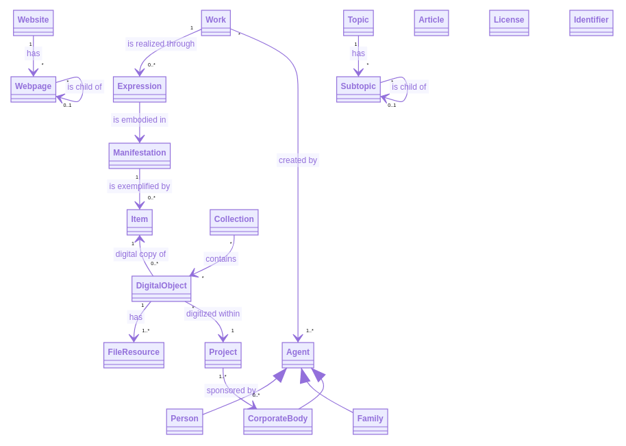

# Digitalcollections Model

[](https://javadoc.io/doc/de.digitalcollections.model/dc-model-parent)
[](https://travis-ci.org/dbmdz/digitalcollections-model)
[](https://codecov.io/gh/dbmdz/digitalcollections-model)
[](LICENSE)
[](https://github.com/dbmdz/digitalcollections-model/releases)
[](https://search.maven.org/search?q=a:dc-model-parent)

Java library containing Domain Object classes of the Digital Collection's and Digital Humanities ecosystem.
Primarily started from the needs for [GLAM](https://en.wikipedia.org/wiki/GLAM_%28industry_sector%29)s (Galleries, Libraries, Archives, Museums) but not restricted to it.

## Business Domain Model

The domain model follows the FRBR ([Functional Requirements for Bibliographic Records](https://en.wikipedia.org/wiki/Functional_Requirements_for_Bibliographic_Records)).
The model is not restricted to books but can handle all sort of creative works and their digital counterparts ("digital objects").

One core statement (taken from [Music Cataloging at Yale](https://web.library.yale.edu/cataloging/music/frbr-wemi-music)) is:

```
"A work is realized by an expression, which is embodied in a manifestation, which is exemplified by an item."
```

And the central object of interest of digital collections is the `DigitalObject` as the digital representation of an item
and curated `Collections` as group of digital objects.



* For presenting digital collections online the library offers `Website` and `Webpage` classes.
* For arranging and describing digital objects by topics the library offers `Topic` and `Subtopic` classes.
* For editorial contribution in the context of digital collections the library offers `Article` with rich text formatting and embedding of different media.

The following classes can be assigned to objects (where appropriate):

* a freely definable `License`
* a list of freely definable `Identifier`s, each of them identifying the object uniquely in an external source system, e.g. GND-ID ("gnd:104330171") or VIAF-ID ("viaf:96994450").

## Class Diagram

The classes are modelled after the business domain model. Common properties and characteristics are expressed through some inheritance (Entity, Identifiable).


## Technical Model Classes

This library supports practical handling of above domain model by adding paging, filtering and sorting classes.

### Filtering-Model

Model for passing technology independent filter criterias
* from frontend to backend via URL-params,
* from Java code to backend

Backend has to take care about implementing technology dependent filtering for given criterias.

#### Filtering by using (user given) URL params

Example usage in a Spring MVC controller: return only webpages with active publication time range

Example URL: http://localhost/v5/webpages?publicationStart=gte:2021-01-01&publicationEnd=lt:2021-10-01

```java
@Operation(summary = "Get all webpages")
@GetMapping(value = {"/v5/webpages", "/v2/webpages"}, produces = MediaType.APPLICATION_JSON_VALUE)
public PageResponse<Webpage> findAll(
    @RequestParam(name = "pageNumber", required = false, defaultValue = "0") int pageNumber,
    @RequestParam(name = "pageSize", required = false, defaultValue = "25") int pageSize,
    @RequestParam(name = "sortBy", required = false) List<Order> sortBy,
    @RequestParam(name = "publicationStart", required = false) FilterCriterion<LocalDate> publicationStart,
    @RequestParam(name = "publicationEnd", required = false) FilterCriterion<LocalDate> publicationEnd) {
  PageRequest pageRequest = new PageRequest(pageNumber, pageSize);
  ...
  Filtering filtering =
      Filtering.defaultBuilder()
          .add("publicationStart", publicationStart)
          .add("publicationEnd", publicationEnd)
          .build();
  pageRequest.setFiltering(filtering);
  return webpageService.find(pageRequest);
}
```

REST-API design for filtering was inspired by:

- [REST API Design: Filtering, Sorting, and Pagination](https://www.moesif.com/blog/technical/api-design/REST-API-Design-Filtering-Sorting-and-Pagination/)
- [An example application using Spring boot MVC, Spring Data JPA with the ability to do filter, pagination and sorting.](https://github.com/vijjayy81/spring-boot-jpa-rest-demo-filter-paging-sorting)

##### Supported URL-params based filter operations

<table border="1">
<caption>Mapping operation abbreviation to filter operation</caption>
  <tr><th>Symbol    </th><th>Operation                        </th><th>Example filter query param             </th></tr>
  <tr><td>eq        </td><td>equals                           </td><td>filter=city:eq:Munich                         </td></tr>
  <tr><td>eq_notset </td><td>equals or not set                </td><td>filter=city:eq_notset:Munich                  </td></tr>
  <tr><td>neq       </td><td>not equals                       </td><td>filter=country:neq:de                         </td></tr>
  <tr><td>gt        </td><td>greater than                     </td><td>filter=amount:gt:10000                        </td></tr>
  <tr><td>gt_notset </td><td>greater than or not set          </td><td>filter=presentationEnd:gt_notset:2020-10-06   </td></tr>
  <tr><td>gte       </td><td>greater than or equals           </td><td>filter=amount:gte:10000                       </td></tr>
  <tr><td>gte_notset</td><td>greater than or equals or not set</td><td>filter=amount:gte_notset:10000                </td></tr>
  <tr><td>lt        </td><td>less than                        </td><td>filter=amount:lt:10000                        </td></tr>
  <tr><td>lt_notset </td><td>less than or not set             </td><td>filter=amount:lt_notset:10000                 </td></tr>
  <tr><td>lt_set    </td><td>less than and set                </td><td>filter=amount:lt_set:10000                    </td></tr>
  <tr><td>lte       </td><td>less than or equals to           </td><td>filter=amount:lte:10000                       </td></tr>
  <tr><td>lte_set   </td><td>less than or equals and set      </td><td>filter=presentationStart:lte_set:2020-10-06   </td></tr>
  <tr><td>lte_notset</td><td>less than or equals or not set   </td><td>filter=presentationStart:lte_notset:2020-10-06</td></tr>
  <tr><td>in        </td><td>in                               </td><td>filter=country:in:uk,usa,au                   </td></tr>
  <tr><td>nin       </td><td>not in                           </td><td>filter=country:nin:fr,de,nz                   </td></tr>
  <tr><td>btn       </td><td>between (inclusive)              </td><td>filter=joiningDate:btn:2018-01-01,2016-01-01  </td></tr>
  <tr><td>like      </td><td>like                             </td><td>filter=firstName:like:John                    </td></tr>
  <tr><td>stw       </td><td>starts with                      </td><td>filter=firstName:stw:A                        </td></tr>
  <tr><td>set       </td><td>value exists (not null)          </td><td>filter=firstName:set:                         </td></tr>
  <tr><td>notset    </td><td>value is not set (null)          </td><td>filter=firstName:notset:                      </td></tr>
</table>

## Model-Serializing

Comes with a separate module for supporting serializing model objects to JSON (`dc-model-jackson module`) using [Jackson](https://github.com/FasterXML/jackson)

## Builder

Many model objects already provide a builder method, which help to instantiate and fill
model objects in a fluent way.

The builder internally holds all attributes of the model class and provides several methods
to set or modify them.

By calling the `build()` method, the model object is instantiated, filled and returned.

### Implementing builders

To implement a new builder, it is important to know, how they work internally.
Since [Lombok](https://projectlombok.org/) is used, every model class must be annotated
with `@SuperBuilder(buildMethodName = "prebuild")`, to enable multi-tier inheritance.

As next step, you have to customize the builder by inheriting it from the
upper-tier builder, e.g.:

```java
public abstract static class Tier2Builder<C extends Tier2Object, B extends Tier2Builder<C, B>> 
    extends Tier1Builder<C, B> {
  
}
```

The `prebuild` configuration allows manipulation of the auto-generated `build` method,
which is renamed to `prebuild`, so that you can write your own `build` method, which must
at least execute `prebuild`.

Since Lombok ignores all member variable pre-settings of the classes (e.g. initializing a list member to an empty Array on instantiation), and internally holds a copy
of all instance variables, an `init()` method to initialize the variables where neccessary 
was applied, which is executed by the constructor and by the `build` method. Please note, 
that you can execute `init` only after `prebuild`, since only `prebuild` gives you the 
instance of your model object.

As a reference, your `build` method, should minimally look like this:
```java
public C build() {
  C c = prebuild();
  c.init();
  return c;
}
```


## Systems using this library

* [cudami (cultural digital asset management)](https://github.com/dbmdz/cudami)